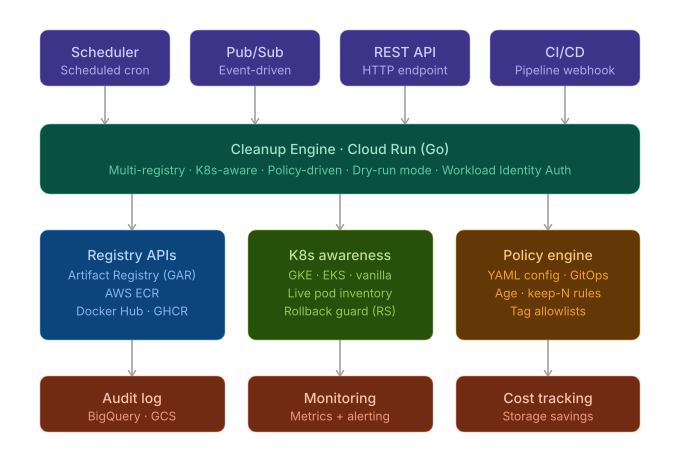

# Architecture

## Platform Overview

`gar-cleanup` is a Go binary that manages the lifecycle of container images stored in **Google Artifact Registry (GAR)**. It replaces the deprecated `gcr.io`-based shell script with a production-grade, policy-driven tool designed to run as a scheduled **Cloud Run Job**.

The system provides:
- **Policy-as-code** image retention rules (YAML, reviewed via PR)
- **Kubernetes guard** to prevent deletion of images actively in use by workloads
- **BigQuery audit trail** for cost attribution and compliance
- **Dry-run by default** for safe operation

---

## System Diagrams

### Cleanup Execution Flow



### Image Lifecycle Platform Architecture



---

## Five-Phase Delivery Plan

| Phase | Scope | Status |
|-------|-------|--------|
| **1 – Core Engine** | Go binary, policy engine, GAR stub client, dry-run mode | ✅ Scaffolded |
| **2 – K8s Guard** | client-go integration; protect digests in use by Pods/RS | 🔲 Stub |
| **3 – Real GAR Client** | Artifact Registry REST API calls via google.golang.org/api | 🔲 Stub |
| **4 – BigQuery Audit** | Stream deletion events to BQ for dashboards | 🔲 Stub |
| **5 – Multi-region** | Iterate over multiple GAR locations and registries | 🔲 Planned |

---

## Component Map

```
cmd/gar-cleanup/
  main.go             ← Cobra CLI: `run` and `version` subcommands

internal/
  policy/
    policy.go         ← YAML policy loading, tag protection, duration parsing
  registry/
    registry.go       ← Client interface (ListRepositories, ListImages, Delete, Untag)
    gar.go            ← GARClient (stub → phase 3) + FakeClient for tests
  engine/
    engine.go         ← Orchestrates inventory → evaluation → delete → audit
  k8s/
    guard.go          ← Guard interface, NoopGuard, ClusterGuard stub (→ phase 2)
  audit/
    audit.go          ← Writer interface, LogWriter, BigQueryWriter stub (→ phase 4)

terraform/
  main.tf             ← Service account, Cloud Run Job, Scheduler, BigQuery table
  variables.tf        ← Input variables
  outputs.tf          ← Output values

policy.yaml           ← Default policy (dry_run: true, keep: 10, max_age: 30d)
```

---

## Key Architectural Decisions

### 1. Dry-run by default
The policy file defaults to `dry_run: true`. Live deletions require an explicit `--live` flag **and** `dry_run: false` in the policy. This two-factor confirmation prevents accidental deletion.

### 2. Policy-as-code
`policy.yaml` is committed to the repository and changes go through pull request review. The policy is mounted into the Cloud Run Job at runtime (via Secret Manager volume in production).

### 3. Functional options for testability
The `Engine` accepts `WithRegistry`, `WithGuard`, and `WithAuditor` options so all external dependencies can be replaced with fakes in unit tests — no mocking frameworks required.

### 4. Interface-first design
`registry.Client`, `k8s.Guard`, and `audit.Writer` are Go interfaces. The production implementations (GAR API, client-go, BigQuery) are replaced by stubs/fakes during testing without any changes to the engine.

### 5. Cloud Run Job (not a long-running service)
The cleanup task has a defined start and end. Cloud Run Jobs provide exactly-once execution semantics, built-in retries, and native IAM integration — a better fit than a Deployment or Cloud Function.

---

## Authentication Design

```
Cloud Scheduler → HTTP POST → Cloud Run Job
                                    ↓
                          google_service_account "gar-cleanup"
                                    ↓
                    ┌───────────────┼───────────────┐
                    ↓               ↓               ↓
          artifactregistry    container.cluster  bigquery.data
          .repoAdmin          Viewer             Editor
```

Authentication uses **Workload Identity** — the Cloud Run Job runs as the `gar-cleanup` service account and receives short-lived tokens automatically. No key files are stored or rotated manually.

For local development, `gcloud auth application-default login` provides equivalent credentials.

---

## Policy Engine Design

```
LoadFile(path) → Policy{
  keep:            int           // retain N most-recent images
  max_age:         duration      // delete images older than this
  protect_tags:    []*regexp     // never delete matching tags
  delete_untagged: bool          // delete digests with no tags
  dry_run:         bool          // policy-level dry-run override
}
```

### Evaluation order (per image, newest-first)

1. **K8s guard** — if digest is in use by any Pod/RS, `actionK8sProtect`
2. **Untagged** — if no tags and `delete_untagged: true`, `actionDelete`
3. **Protected tag** — if any tag matches `protect_tags`, `actionRetain`
4. **Keep count** — if rank < `keep`, `actionRetain`
5. **Max age** — if pushed before cutoff, `actionDelete`
6. **Default** — `actionRetain`

---

## Observability Design

| Signal | Implementation | Phase |
|--------|---------------|-------|
| Structured logs | `log/slog` JSON to Cloud Logging | ✅ Now |
| Audit events (dry-run) | `LogWriter` → Cloud Logging | ✅ Now |
| Audit events (live) | `BigQueryWriter` → BQ table | Phase 4 |
| Metrics | Cloud Monitoring via Cloud Run built-ins | Phase 5 |
| Alerting | BQ scheduled query → Cloud Monitoring | Phase 5 |

All log lines include `project`, `location`, `mode`, `repository`, `digest`, and `reason` fields for easy filtering in Cloud Logging.
